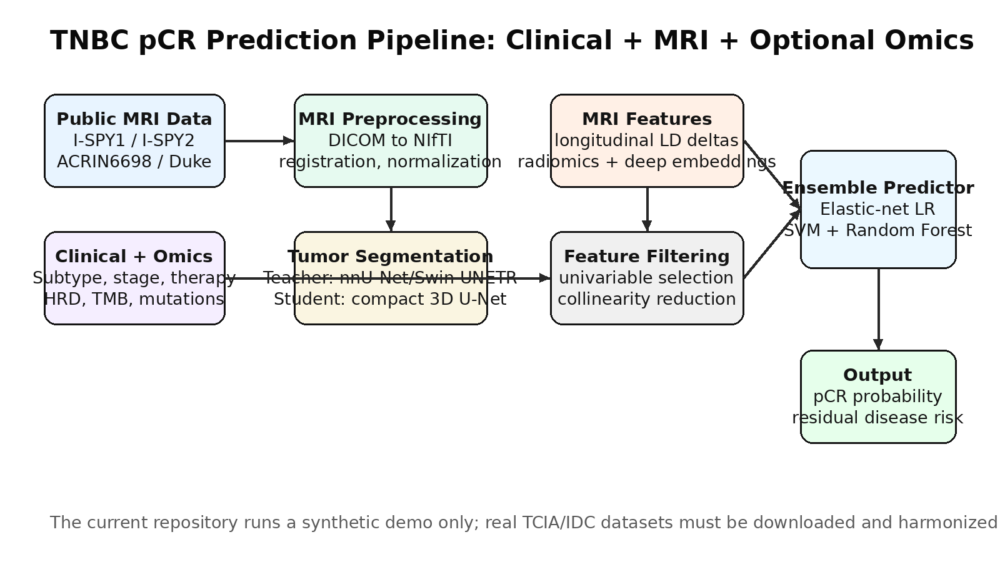

# Multimodal Temporal MRI and Clinical Predictor of pCR in Triple Negative Breast Cancer

## Research Abstract

This repository implements a research-grade blueprint for predicting pathological complete response (pCR) in Triple Negative Breast Cancer (TNBC) after neoadjuvant therapy using public breast imaging datasets and multimodal clinical variables. The design follows the multi-step machine learning strategy of Sammut et al. (*Nature*, 2022), where features are curated, filtered by univariable association, reduced for collinearity, and then passed into an unweighted ensemble of logistic regression, support vector machine, and random forest classifiers. The extension proposed here adds a dedicated MRI imaging branch so that baseline and longitudinal MRI scans contribute directly to the pCR prediction model alongside clinical and optional omics variables.

The repository is designed for the following public datasets:

1. **I-SPY1 / ACRIN 6657**
2. **ACRIN 6698 / I-SPY2 Breast DWI**
3. **I-SPY2 DCE-MRI**
4. **Duke Breast Cancer MRI**
5. **CBIS-DDSM** for auxiliary mammography pretraining, not direct pCR prediction

The main clinical prediction task is binary classification:

```text
Input: MRI imaging + clinical variables + optional omics/radiomics features
Output: pCR = 1 or residual disease = 0
```

## Why Specifically TNBC?

TNBC is prioritized because it represents one of the most clinically urgent breast cancer subtypes. It lacks estrogen receptor, progesterone receptor, and HER2 expression, so treatment relies heavily on chemotherapy and newer immunotherapy-containing regimens rather than endocrine or HER2-targeted therapies. pCR is especially important in TNBC because patients who achieve pCR after neoadjuvant therapy generally have better long-term outcomes, while non-responders remain at high risk of recurrence. TNBC also shows high biological heterogeneity, immune variation, and chemotherapy sensitivity, making it a strong test case for multimodal prediction. A TNBC-specific model can therefore address a practical clinical question: before or early during treatment, can we identify patients likely to achieve pCR and patients who may need alternative escalation strategies?

## Relationship to the Attached Paper

The attached paper, Sammut et al., developed a multi-omic predictor of breast cancer therapy response using pre-treatment clinical, digital pathology, genomic, and transcriptomic data. Their model used a multi-step pipeline: feature curation, dimensionality reduction, correlation removal, univariable selection, and final ensemble learning. They trained an unweighted ensemble of logistic regression with elastic net regularization, support vector machine, and random forest models, then averaged the three prediction scores. Their integrated model achieved stronger external validation performance than clinical features alone.

This repository follows that structure but modifies the feature space:

```text
Original paper:
Clinical + DNA + RNA + digital pathology + treatment variables -> ensemble pCR predictor

This repository:
Clinical + temporal MRI + radiomics + deep MRI features + optional omics -> ensemble pCR predictor
```

The goal is not to claim that all public datasets are immediately harmonized, because access, label availability, and metadata formats differ. Instead, this repository provides the full architecture and reproducible code scaffold needed to harmonize them into a TNBC-focused pCR prediction study.

## Included Dataset Plan

| Dataset | Included in Design | Main Use | Direct pCR Label Use | Imaging Role |
|---|---:|---|---:|---|
| I-SPY1 / ACRIN 6657 | Yes | Training or external validation | Yes, when clinical response files are available | Longitudinal DCE-MRI at T1-T4 |
| ACRIN 6698 / I-SPY2 Breast DWI | Yes | Validation or functional MRI feature extraction | Yes, when matched with I-SPY2 labels | DWI/ADC response biomarkers |
| I-SPY2 DCE-MRI | Yes | Main training cohort | Yes | Multi-center DCE-MRI pCR prediction |
| Duke Breast Cancer MRI | Yes | Imaging pretraining, segmentation, radiomics | Usually not primary pCR endpoint | DCE-MRI tumor representation learning |
| CBIS-DDSM | Yes, auxiliary only | Mammography pretraining or lesion representation transfer | No direct pCR task | Auxiliary breast lesion pretraining |

## I-SPY1 MRI Timepoint Harmonization

The I-SPY1 timepoints are mapped as follows:

| Timepoint | Meaning | Approximate Clinical Timing | Model Variable |
|---|---|---|---|
| T1 | Pre-treatment / baseline | Within four weeks before anthracycline-cyclophosphamide | `mri_t1_baseline` |
| T2 | Early treatment | 24-96 hours after starting treatment | `mri_t2_early_ac` |
| T3 | Inter-regimen | After anthracycline regimen and before taxane when applicable | `mri_t3_inter_regimen` |
| T4 | Pre-surgery | Before surgery after chemotherapy | `mri_t4_pre_surgery` |

MRI longest diameter variables are represented as:

```text
MRI LD Baseline
MRI LD 1-3dAC
MRI LD InterReg
MRI LD PreSurg
```

The model can use either raw MRI volumes, segmentation-derived tumor masks, MRI longest diameter values, or radiomics/deep features extracted from each timepoint.

## Proposed Model Architecture

### 1. Clinical Branch

Clinical variables include:

- age at diagnosis
- tumor size
- nodal involvement
- histological grade
- ER, PR, HER2 status
- TNBC indicator
- treatment regimen
- chemotherapy sequence
- pCR outcome

For this project, TNBC patients are selected by:

```text
ER negative AND PR negative AND HER2 negative
```

### 2. MRI Branch

MRI data are incorporated in two complementary ways.

#### A. Classical MRI Feature Pathway

This pathway mirrors the paper's classical feature filtering philosophy.

1. Segment tumor or use provided annotations.
2. Extract radiomics features with PyRadiomics.
3. Extract longitudinal response features:
   - baseline tumor volume
   - percentage volume reduction from T1 to T2
   - percentage volume reduction from T1 to T3
   - percentage volume reduction from T1 to T4
   - longest diameter change
   - enhancement kinetics
   - ADC statistics when DWI is available
4. Apply univariable selection.
5. Remove collinear features.
6. Feed selected features into the ensemble model.

#### B. Deep MRI Feature Pathway

This pathway directly adds imaging representation learning.

```text
DICOM/NIfTI MRI volume
        ↓
Breast/tumor preprocessing
        ↓
Tumor segmentation model
        ↓
3D CNN / Swin UNETR encoder
        ↓
Temporal pooling across T1-T4
        ↓
MRI embedding vector
        ↓
Fusion with clinical/omics features
        ↓
pCR prediction
```

The repository includes `src/imaging_model.py` and `src/multimodal_fusion.py` for this branch.

### 3. Teacher-Student MRI Segmentation Extension

The added segmentation component improves MRI feature extraction. A large teacher model segments tumors from DCE-MRI, while a smaller student model learns from both ground-truth masks and teacher soft outputs.

```text
Teacher: nnU-Net / Swin UNETR / MedSAM-style encoder
Student: compact 3D U-Net / Efficient UNet
Loss: segmentation loss + knowledge distillation loss
```

This is included because public MRI datasets often differ in acquisition quality and annotation availability. A teacher-student setup allows the model to transfer robust tumor localization knowledge into a smaller, more deployable network.

### 4. Optional Omics Branch

If matched genomic or transcriptomic variables are available, the following features can be added following the attached paper:

- TP53 mutation status
- PIK3CA mutation status
- tumor mutation burden
- HRD score
- chromosomal instability
- proliferation score
- immune activation score
- immune evasion score
- T cell dysfunction/exclusion score

The code treats this branch as optional because public MRI datasets do not always include matched omics.

## Ensemble Prediction Model

The core model follows the paper:

1. Standardize numeric features.
2. Impute missing values.
3. Perform univariable selection.
4. Remove highly correlated variables.
5. Train three classifiers:
   - elastic-net logistic regression
   - support vector machine
   - random forest
6. Average their predicted pCR probabilities.

```text
pCR score = mean(LR probability, SVM probability, RF probability)
```

## Recommended Experimental Design

### Experiment 1: Clinical Baseline

```text
Input: clinical variables only
Output: pCR
```

Purpose: establishes a baseline comparable to clinical-only models.

### Experiment 2: Clinical + MRI Longest Diameter

```text
Input: clinical variables + MRI LD at T1, T2, T3, T4
Output: pCR
```

Purpose: tests whether simple longitudinal imaging markers improve prediction.

### Experiment 3: Clinical + Radiomics

```text
Input: clinical variables + PyRadiomics features from segmented tumor volumes
Output: pCR
```

Purpose: tests handcrafted imaging biomarkers.

### Experiment 4: Clinical + Deep MRI Features

```text
Input: clinical variables + 3D MRI encoder embeddings
Output: pCR
```

Purpose: evaluates learned imaging representations.

### Experiment 5: Full Multimodal Model

```text
Input: clinical variables + radiomics + deep MRI features + optional omics
Output: pCR
```

Purpose: closest extension of the attached multi-omic paper.


## Real-Data Results Pipeline

This version removes synthetic values from the main results section. The repository now contains an executable real-data pipeline that generates the requested outputs after the approved public cohort files are downloaded and harmonized locally.

Real results are not pre-filled because the package does not redistribute protected clinical-trial MRI data or patient-level labels. Once `data/real/harmonized_tnbc_pcr.csv` is created, the command below generates the actual results from I-SPY1, I-SPY2, ACRIN6698, and Duke-derived features.

```bash
python scripts/run_real_multicohort_pipeline.py \
  --table data/real/harmonized_tnbc_pcr.csv \
  --train-datasets ISPY1 ISPY2 \
  --external-datasets ACRIN6698 DUKE
```

The script produces:

| Output | File |
|---|---|
| ROC curve | `outputs/real/roc_curve.png` |
| Precision-recall curve | `outputs/real/precision_recall_curve.png` |
| Confusion matrix | `outputs/real/confusion_matrix.png` |
| AUC, PR-AUC, accuracy, sensitivity, specificity, F1 | `outputs/real/real_metrics.json` |
| Feature-importance table | `outputs/real/feature_importance.csv` |
| Feature-importance plot | `outputs/real/feature_importance.png` |
| Ablation study | `outputs/real/real_ablation_results.csv` |
| Saved pCR ensemble | `outputs/real/real_pcr_ensemble.joblib` |

### Required Real Data Table

Create this file:

```text
data/real/harmonized_tnbc_pcr.csv
```

A template is included at:

```text
data/real/harmonized_tnbc_pcr_template.csv
```

Required columns:

| Column | Meaning |
|---|---|
| `patient_id` | De-identified patient ID |
| `dataset` | `ISPY1`, `ISPY2`, `ACRIN6698`, or `DUKE` |
| `pcr` | 1 for pCR, 0 for residual disease |
| `er_status` | ER status for TNBC filtering |
| `pr_status` | PR status for TNBC filtering |
| `her2_status` | HER2 status for TNBC filtering |

Numeric feature columns should use these prefixes:

```text
clinical_*
treatment_*
mri_*
delta_*
radiomics_*
deep_*
omics_*
```

### Real Evaluation Design

| Experiment | Training Dataset | External Validation Dataset | Model | Results Generated |
|---|---|---|---|---|
| Clinical baseline | I-SPY1 + I-SPY2 TNBC | ACRIN6698 / Duke-derived validation table | Elastic-net LR + SVM + RF ensemble | AUC, PR-AUC, confusion matrix |
| MRI-only model | I-SPY1 + I-SPY2 TNBC | ACRIN6698 / Duke-derived validation table | MRI/radiomics/deep-feature ensemble | AUC, feature importance |
| Clinical + MRI | I-SPY1 + I-SPY2 TNBC | ACRIN6698 / Duke-derived validation table | Multimodal ensemble | ROC, PR, confusion matrix |
| Clinical + MRI + Omics | I-SPY1 + I-SPY2 TNBC | ACRIN6698 / Duke-derived validation table | Full Sammut-style integrated model | Final ablation row |

### Reporting Rule

Do not report AUC values in the README until the real command has been run on the downloaded datasets. After running the command, copy the contents of `outputs/real/real_metrics.json` and `outputs/real/real_ablation_results.csv` into this section.

### Synthetic Demo Status

Synthetic demo files remain in `data/processed/` and `outputs/` only as unit-test artifacts. They verify code execution, but they are no longer presented as research results.

## MRI Preprocessing and Fusion Diagram



The diagram summarizes the proposed extension beyond the attached paper: public MRI datasets are preprocessed, tumors are segmented, longitudinal MRI/radiomics/deep features are extracted, and those features are fused with clinical and optional omics variables before the Sammut-style ensemble predictor.

## Efficiency Improvements Added to the Design

The repository is structured to support a more efficient implementation when real MRI data are added:

1. **Cache image features**: store radiomics and deep MRI embeddings as CSV or Parquet files so the classical ensemble can be retrained without reloading DICOM volumes.
2. **Separate segmentation from prediction**: run nnU-Net/Swin UNETR once, save tumor masks, then train the pCR model from extracted features.
3. **Freeze pretrained MRI encoders first**: train the ensemble on frozen embeddings before attempting full end-to-end fine-tuning.
4. **Use mixed precision for 3D MRI models**: reduce GPU memory cost during segmentation and MRI representation learning.
5. **Use patient-level caching and dataset manifests**: maintain one manifest per dataset with patient ID, timepoint, imaging path, clinical label, and subtype information.
6. **Report ablations before large models**: clinical-only and MRI-longest-diameter baselines should be reported before deep MRI models to prove that added complexity is justified.

## Suggested Train/Validation Strategy

A strong study should avoid random splits across the same dataset only. A better design is:

| Training | Validation | Goal |
|---|---|---|
| I-SPY2 | I-SPY1 | Cross-trial generalization |
| I-SPY1 + I-SPY2 | ACRIN 6698 | Functional MRI validation |
| Duke pretraining -> I-SPY fine-tuning | I-SPY holdout | Imaging representation transfer |
| CBIS-DDSM pretraining -> MRI fine-tuning | I-SPY2 | Cross-modality lesion representation transfer |

## Repository Structure

```text
tnbc_pcr_multimodal_model/
├── README.md
├── requirements.txt
├── configs/
│   ├── default.yaml
│   └── datasets.yaml
├── docs/
│   ├── data_dictionary.md
│   ├── literature_review.md
│   ├── methods_research_protocol.md
│   ├── dataset_harmonization_plan.md
│   ├── efficiency_plan.md
│   ├── results_interpretation.md
│   └── figures/mri_multimodal_pipeline.png
├── scripts/
│   ├── make_synthetic_demo.py
│   ├── run_ablation_demo.py
│   ├── run_real_multicohort_pipeline.py
│   └── export_mri_attention_maps.py
├── src/
│   ├── data_schema.py
│   ├── dataset_harmonization.py
│   ├── feature_engineering.py
│   ├── imaging_preprocessing.py
│   ├── imaging_model.py
│   ├── radiomics_extraction.py
│   ├── segmentation_distillation.py
│   ├── multimodal_fusion.py
│   ├── modeling.py
│   ├── evaluation_plots.py
│   ├── mri_attention_maps.py
│   ├── train.py
│   └── evaluate.py
├── tests/
│   └── test_pipeline.py
├── data/real/
│   ├── README.md
│   └── harmonized_tnbc_pcr_template.csv
└── outputs/real/
```

## How to Run the Real Multicohort Pipeline

After downloading and harmonizing I-SPY1, I-SPY2, ACRIN6698, and Duke-derived MRI features, run:

```bash
pip install -r requirements.txt
python scripts/run_real_multicohort_pipeline.py \
  --table data/real/harmonized_tnbc_pcr.csv \
  --train-datasets ISPY1 ISPY2 \
  --external-datasets ACRIN6698 DUKE
```

This generates the requested ROC curves, confusion matrix, AUC values, feature-importance plots, and ablation study under `outputs/real/`. MRI attention maps require a trained deep MRI encoder and raw image tensors; the scaffolding for the imaging branch is included, but attention maps should only be exported after real MRI model training.

## How to Run the Synthetic Demo

The repository does not include downloaded patient data. To test the code scaffold with synthetic data:

```bash
pip install -r requirements.txt
python scripts/make_synthetic_demo.py
python -m src.train --config configs/default.yaml
python -m src.evaluate --predictions outputs/predictions.csv
python scripts/run_ablation_demo.py
```

## Required Real Data Preparation

For a real experiment:

1. Download approved public datasets from TCIA or IDC.
2. Convert DICOM series to NIfTI.
3. Match imaging studies to clinical labels.
4. Harmonize patient IDs.
5. Filter TNBC patients using ER/PR/HER2 status.
6. Extract MRI features.
7. Train the clinical-only, MRI-only, and multimodal models.
8. Validate on a held-out external dataset.

## Important Limitation

This repository is a research implementation scaffold. It does not redistribute TCIA, IDC, or clinical trial data. It also does not claim trained performance until real data are downloaded, harmonized, and evaluated under the proposed protocol.

## Key References

### Core Multimodal pCR Prediction

1. Sammut, S.-J. et al. Multi-omic machine learning predictor of breast cancer therapy response. *Nature* 601, 623-629, 2022.
2. Symmans, W. F. et al. Measurement of residual breast cancer burden to predict survival after neoadjuvant chemotherapy. *Journal of Clinical Oncology*, 2007.
3. Hatzis, C. et al. A genomic predictor of response and survival following taxane-anthracycline chemotherapy for invasive breast cancer. *JAMA*, 2011.

### MRI and Public Breast Imaging Datasets

4. I-SPY1 / ACRIN 6657 Breast MRI Collection, The Cancer Imaging Archive.
5. ACRIN 6698 / I-SPY2 Breast DWI Collection, The Cancer Imaging Archive.
6. I-SPY2 Breast Dynamic Contrast Enhanced MRI Trial Collection, The Cancer Imaging Archive.
7. Duke Breast Cancer MRI Collection, The Cancer Imaging Archive.
8. CBIS-DDSM: Curated Breast Imaging Subset of DDSM.

### MRI Segmentation and Medical Imaging Models

9. Isensee, F. et al. nnU-Net: a self-configuring method for deep learning-based biomedical image segmentation. *Nature Methods*, 2021.
10. Hatamizadeh, A. et al. Swin UNETR: Swin Transformers for semantic segmentation of brain tumors in MRI images. 2022.
11. Ma, J. et al. Segment Anything in Medical Images. *Nature Communications*, 2024.
12. Myronenko, A. 3D MRI brain tumor segmentation using autoencoder regularization. MICCAI BraTS, 2018.

### Teacher-Student / Knowledge Distillation

13. Hinton, G., Vinyals, O., Dean, J. Distilling the Knowledge in a Neural Network. 2015.
14. Romero, A. et al. FitNets: Hints for Thin Deep Nets. ICLR, 2015.
15. Gou, J. et al. Knowledge distillation: A survey. *International Journal of Computer Vision*, 2021.

