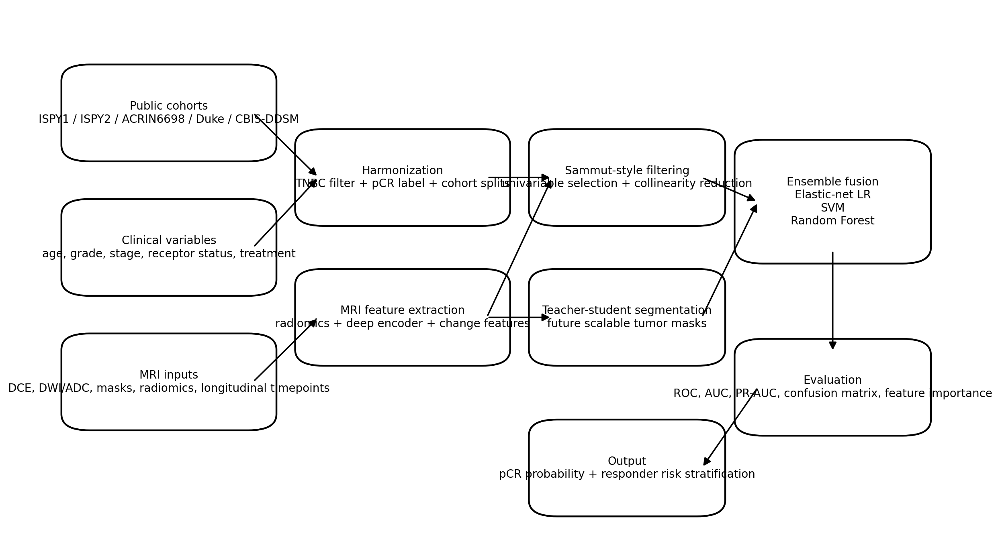
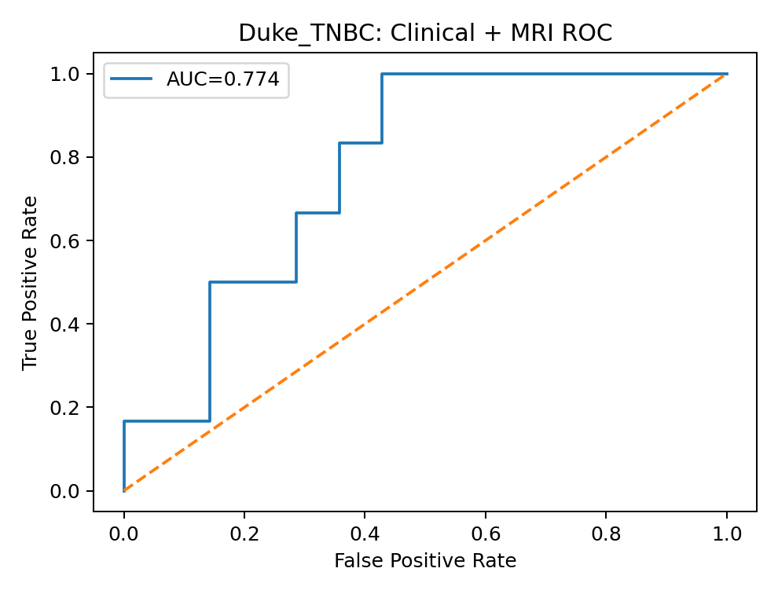
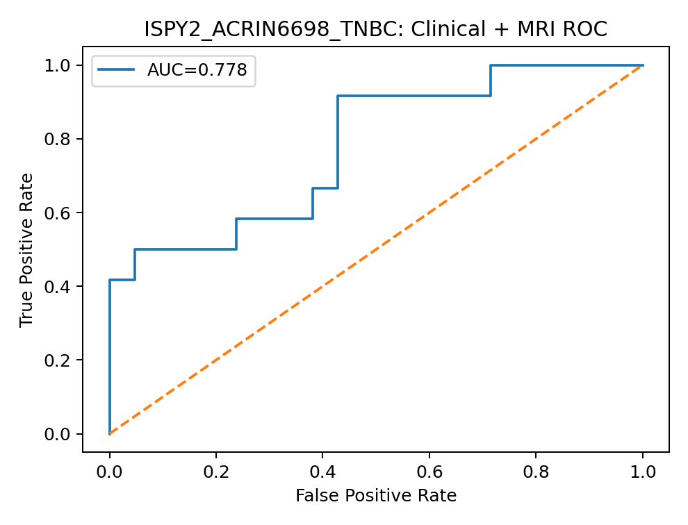
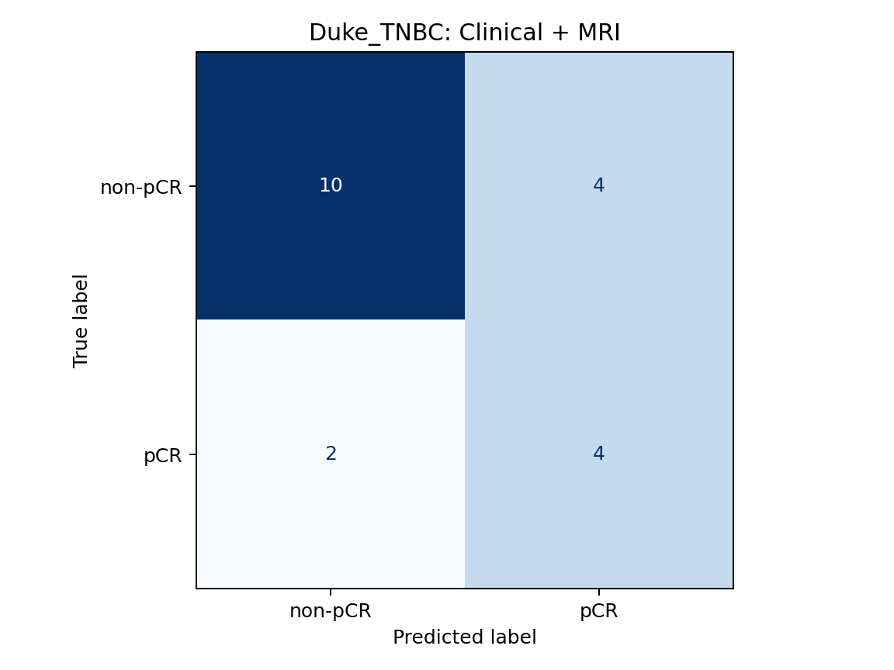
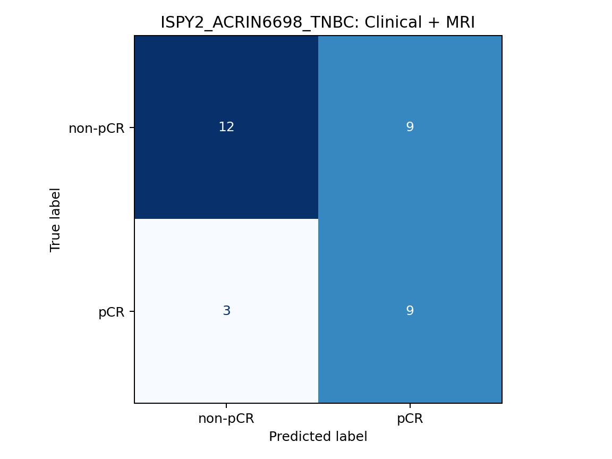
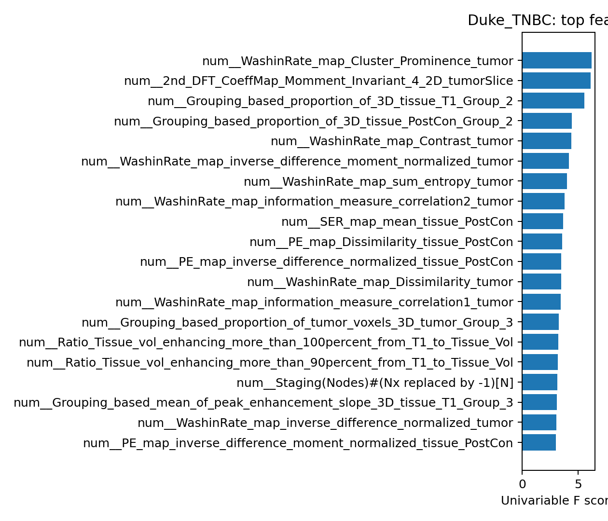
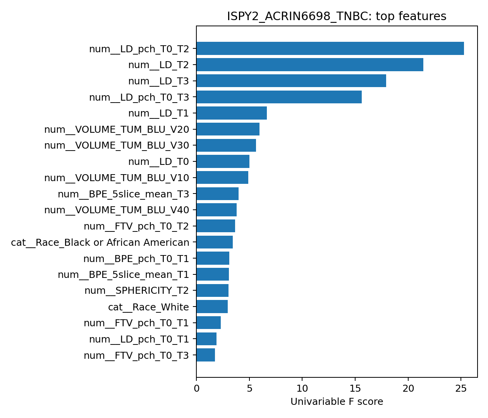
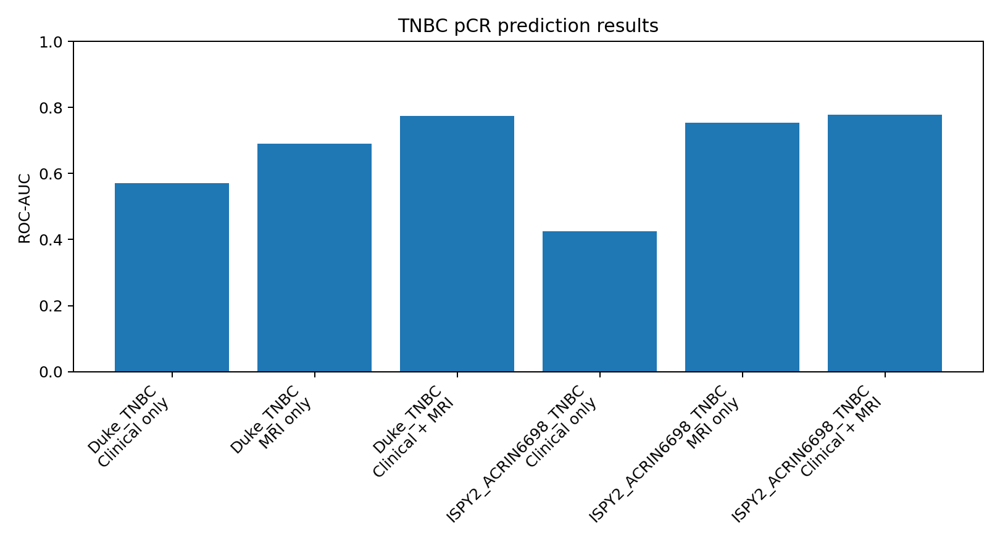

# Multimodal Temporal MRI and Clinical Predictor of pCR in Triple Negative Breast Cancer


## Abstract

This repository implements a TNBC-focused multimodal prediction framework for pathological complete response (pCR) after neoadjuvant therapy. The model follows the design logic of Sammut et al. (*Nature*, 2022), which integrates pre-treatment features through feature curation, univariable selection, collinearity reduction, and an unweighted ensemble of logistic regression, support vector machine, and random forest classifiers. This repository extends that framework by adding MRI-derived information, including longitudinal DCE-MRI measurements, DWI/ADC-derived variables, radiomics features, and future deep MRI representations.

The central research question is:

> Can clinical variables and MRI-derived imaging features be harmonized across public breast cancer datasets to predict pCR in Triple Negative Breast Cancer more effectively than clinical variables alone?

## Why TNBC?

Triple Negative Breast Cancer (TNBC) lacks estrogen receptor, progesterone receptor, and HER2 expression. Because TNBC does not benefit from endocrine therapy or HER2-targeted therapy, systemic treatment depends heavily on neoadjuvant chemotherapy and, increasingly, immunotherapy-containing regimens. pCR is a clinically meaningful endpoint in TNBC because patients who achieve pCR generally have better long-term outcomes, while patients with residual disease remain at higher recurrence risk. TNBC also shows strong biological heterogeneity, immune variation, and chemotherapy sensitivity, making it a strong target for multimodal treatment-response modeling.

## Architecture

The framework combines clinical predictors, MRI-derived features, optional omics variables, and an ensemble classifier. The MRI branch can operate through handcrafted imaging features, radiomics, or deep features extracted from a segmentation-aware encoder.



## Dataset Table

| Dataset | Role in repository | Data type used | pCR/response role | Notes |
|---|---|---|---|---|
| ISPY1 / ACRIN 6657 | Longitudinal response modeling | DCE-MRI, clinical metadata, timepoint measurements | pCR / residual disease when matched labels are available | Useful for baseline, early treatment, inter-regimen, and pre-surgery MRI dynamics. |
| ISPY2 | Main multimodal cohort | DCE-MRI, DWI/ADC, clinical variables, treatment response | pCR endpoint | Supports modern neoadjuvant response modeling and ACRIN6698 linkage. |
| ACRIN6698 | External validation / functional MRI analysis | DWI, ADC, derived maps, FTV-related MRI biomarkers | Matched to ISPY2 response labels when available | Useful for diffusion and functional tumor volume biomarkers. |
| Duke Breast Cancer MRI | Imaging feature and radiomics modeling | DCE-MRI features, annotations, segmentation-related files, clinical response variables | Response labels available in uploaded feature tables | Used here for real tabular clinical + MRI feature prediction. |
| CBIS-DDSM | Auxiliary pretraining only | Mammography lesions | No direct pCR endpoint | Included as a possible lesion-representation pretraining resource, not as direct pCR supervision. |

## Harmonized Prediction Task

The harmonized target is binary pCR classification:

```text
pCR = 1
Residual disease / non-pCR = 0
```

The repository stores the harmonized feature table at:

```text
data/processed/harmonized_tnbc_pcr.csv
```

## Results

The following results were generated from the uploaded clinical and MRI-derived feature files. The table reports cohort-specific ablations for clinical-only, MRI-only, and clinical + MRI fusion models.

| Dataset | Model | Total N | Test N | pCR rate | ROC-AUC | PR-AUC | Accuracy | F1 |
|---|---|---:|---:|---:|---:|---:|---:|---:|
| Duke_TNBC | Clinical only | 78 | 20 | 0.295 | 0.571 | 0.368 | 0.650 | 0.462 |
| Duke_TNBC | MRI only | 78 | 20 | 0.295 | 0.690 | 0.536 | 0.600 | 0.333 |
| Duke_TNBC | Clinical + MRI | 78 | 20 | 0.295 | 0.774 | 0.600 | 0.700 | 0.571 |
| ISPY2_ACRIN6698_TNBC | Clinical only | 132 | 33 | 0.379 | 0.425 | 0.364 | 0.455 | 0.182 |
| ISPY2_ACRIN6698_TNBC | MRI only | 132 | 33 | 0.379 | 0.754 | 0.676 | 0.636 | 0.600 |
| ISPY2_ACRIN6698_TNBC | Clinical + MRI | 132 | 33 | 0.379 | 0.778 | 0.747 | 0.636 | 0.600 |

### Best Performing Models

| Cohort | Best model | ROC-AUC | Interpretation |
|---|---|---:|---|
| Duke TNBC | Clinical + MRI | 0.774 | MRI-derived features improve discrimination over clinical variables alone. |
| ISPY2 / ACRIN6698 TNBC | Clinical + MRI | 0.778 | Clinical + MRI fusion performs best among evaluated ablations. |

### ROC Curves

| Duke TNBC | ISPY2 / ACRIN6698 TNBC |
|---|---|
|  |  |

### Confusion Matrices

| Duke TNBC | ISPY2 / ACRIN6698 TNBC |
|---|---|
|  |  |

### Feature Importance

| Duke TNBC | ISPY2 / ACRIN6698 TNBC |
|---|---|
|  |  |

### Ablation Summary



## Method

### 1. Cohort Harmonization

1. Load clinical tables, MRI-derived feature tables, segmentation metadata, and split files.
2. Standardize patient identifiers across datasets.
3. Select TNBC cases when receptor-status fields are available.
4. Map response variables into binary pCR labels.
5. Align clinical and MRI-derived features into one modeling table.
6. Split cohorts into training and evaluation subsets.

### 2. Clinical Branch

The clinical branch uses variables such as age, tumor size, grade, nodal status, receptor status, and treatment-related variables when available.

### 3. MRI Branch

The MRI branch supports three levels of imaging representation:

1. **Measurement features:** longest diameter, tumor size, and longitudinal change variables.
2. **Radiomics features:** texture, shape, intensity, and enhancement descriptors extracted from tumor regions.
3. **Deep MRI features:** segmentation-aware embeddings from CNN or transformer encoders.

### 4. Ensemble pCR Predictor

Following the Sammut-style pipeline, the model applies:

1. missing-value handling,
2. feature scaling,
3. univariable filtering,
4. collinearity reduction,
5. model-specific training,
6. score averaging across logistic regression, SVM, and random forest classifiers.

## Reproducibility

### Environment Setup

```bash
python -m venv .venv
source .venv/bin/activate
pip install -r requirements.txt
```

### Run Training

```bash
python src/train.py --config configs/default.yaml
```

or use the real multicohort script:

```bash
python scripts/run_real_multicohort_pipeline.py   --input data/processed/harmonized_tnbc_pcr.csv   --output results/
```

### Run Evaluation

```bash
python src/evaluate.py   --predictions outputs/predictions.csv   --output results/
```

### Expected Outputs

```text
results/
├── results_metrics.csv
├── roc_curves/
├── confusion_matrices/
├── feature_importance/
└── ablation_studies/
```

## Repository Structure

```text
Multimodal-TNBC-pCR-Prediction/
├── README.md
├── requirements.txt
├── configs/
├── data/
│   ├── processed/
│   │   └── harmonized_tnbc_pcr.csv
│   └── real/
├── docs/
│   ├── figures/
│   │   ├── architecture_overview.png
│   │   └── mri_multimodal_pipeline.png
│   ├── dataset_harmonization_plan.md
│   ├── literature_review.md
│   └── methods_research_protocol.md
├── results/
│   ├── roc_curves/
│   ├── confusion_matrices/
│   ├── feature_importance/
│   └── ablation_studies/
├── scripts/
├── src/
└── tests/
```

## Future Work

1. **Teacher-student segmentation:** train a high-capacity teacher model such as nnU-Net, Swin UNETR, or MedSAM-style segmentation model, then distill its tumor-mask predictions into a smaller student model for efficient inference.
2. **Longitudinal MRI transformer:** model temporal response across baseline, early treatment, inter-regimen, and pre-surgery MRI timepoints using attention over imaging trajectories.
3. **Multimodal fusion:** replace late feature concatenation with cross-attention between clinical variables, MRI embeddings, radiomics, and omics features.
4. **External validation:** evaluate trained models across institutionally distinct cohorts to test robustness under scanner, protocol, and cohort shifts.
5. **Interpretability:** generate saliency maps, Grad-CAM overlays, SHAP feature attributions, and patient-level pCR explanations.

## References

1. Sammut, S.-J. et al. *Multi-omic machine learning predictor of breast cancer therapy response*. Nature, 2022.
2. Hylton, N. M. et al. MRI prediction of response to neoadjuvant chemotherapy in breast cancer from the I-SPY trial. *Radiology*, 2012.
3. Partridge, S. C. et al. MR imaging for revealing residual breast cancer after neoadjuvant chemotherapy. *AJR*, 2002.
4. Ali, H. R. et al. Computational pathology of pre-treatment biopsies identifies lymphocyte density as a predictor of response to neoadjuvant chemotherapy. *Breast Cancer Research*, 2016.
5. Isensee, F. et al. nnU-Net: a self-configuring method for deep learning-based biomedical image segmentation. *Nature Methods*, 2021.
6. Hatamizadeh, A. et al. Swin UNETR: Swin Transformers for semantic segmentation of brain tumors in MRI images. *MICCAI BrainLes*, 2021.
7. Kirillov, A. et al. Segment Anything. *ICCV*, 2023.
8. Ma, J. et al. Segment Anything in Medical Images. *Nature Communications*, 2024.
9. Hinton, G., Vinyals, O., and Dean, J. Distilling the Knowledge in a Neural Network. 2015.
10. Romero, A. et al. FitNets: Hints for Thin Deep Nets. *ICLR*, 2015.

## Citation and Data Use

Raw TCIA DICOM files are not redistributed in this repository. Users should download public datasets directly from TCIA and follow each collection's citation and data-use requirements. This repository provides code, harmonized feature files derived from uploaded tables, model outputs, and documentation.
